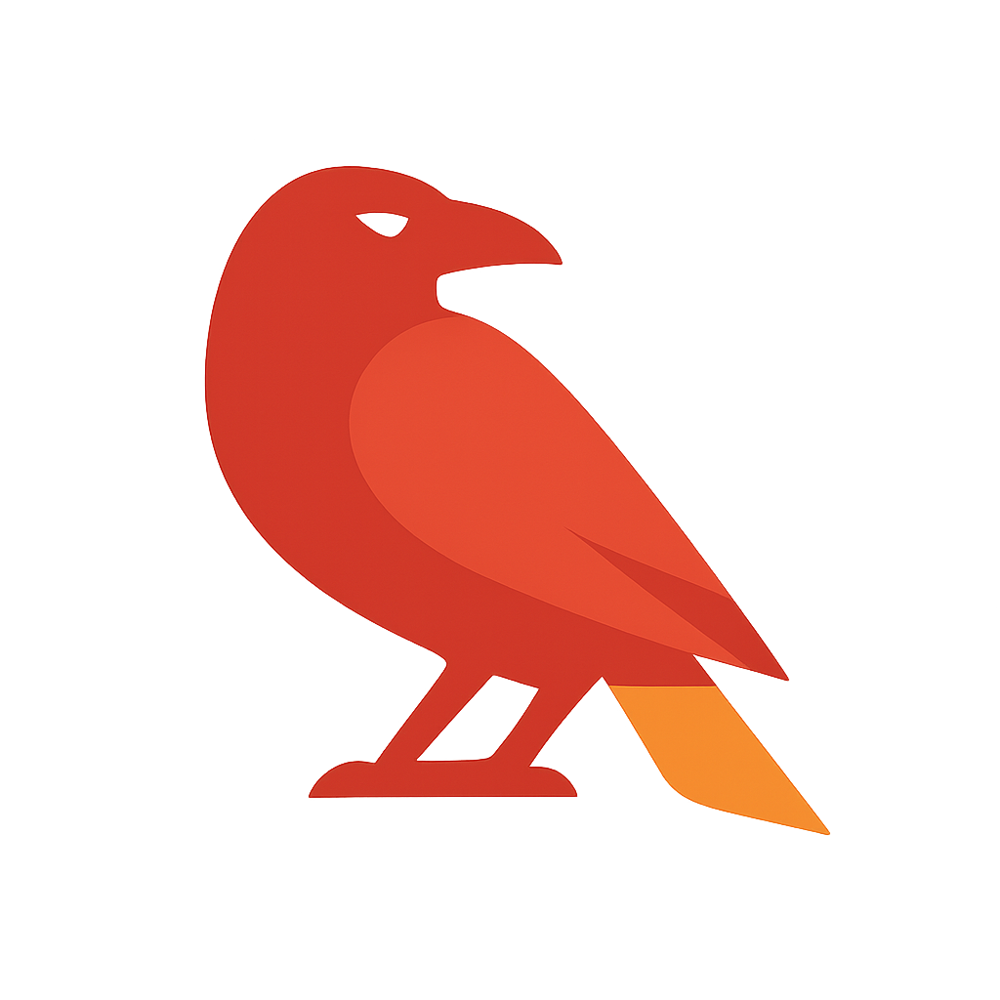

    <h1>Ignis</h1>
    
    <h5> Fiery and proper JVM, fresh out. :fire: </h5>

# :sparkles: Something... _lighter_
Ignis is a Rust-native JVM implementation, for those who miss Java's idealism but crave Rust's ruthlessness.

## References:

 [JVM Specification](https://docs.oracle.com/javase/specs/jvms/se24/html/index.html): Java SE 24 Edition
